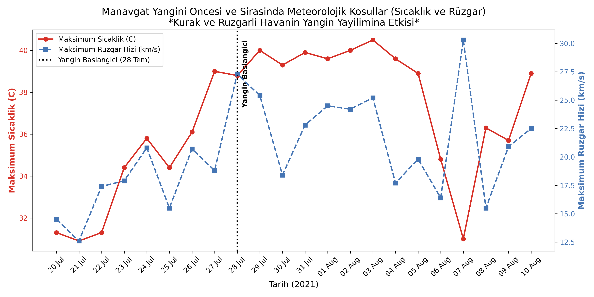
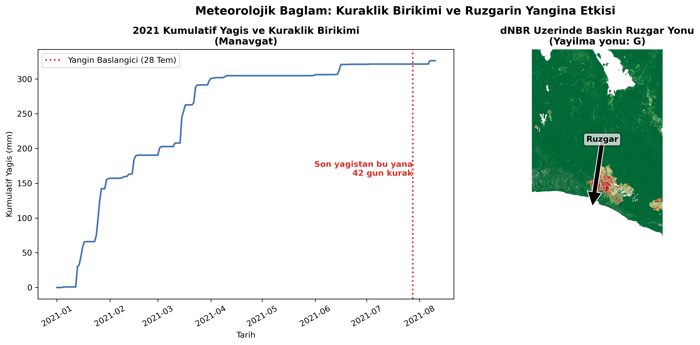
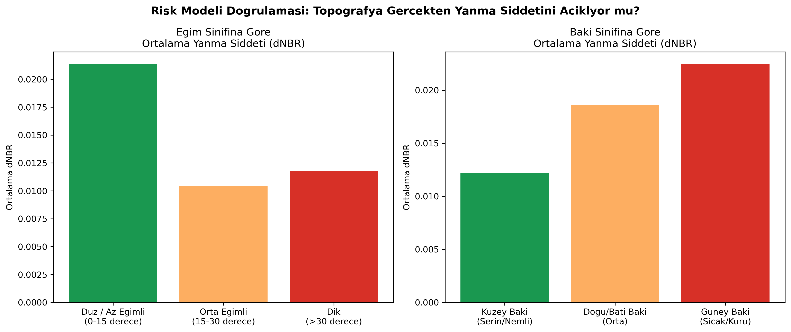
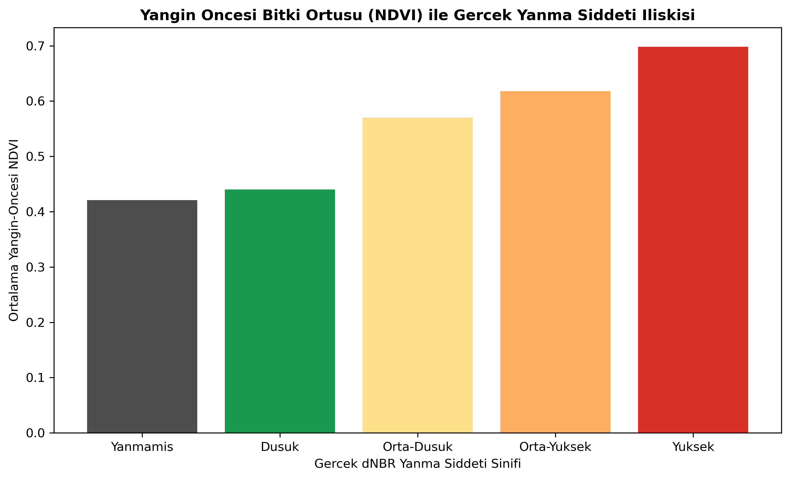
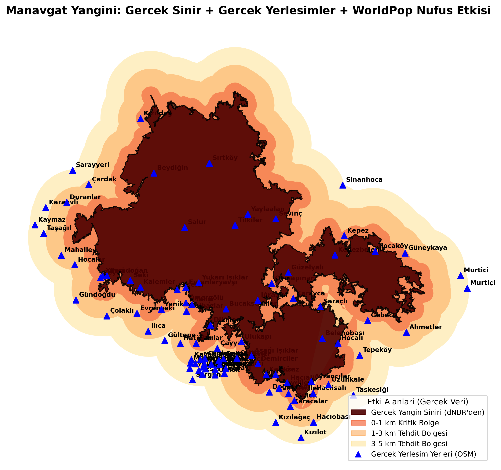
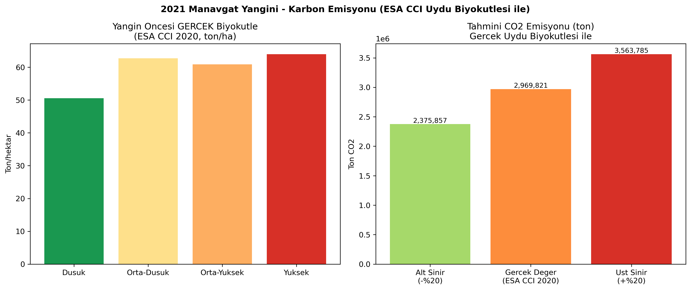
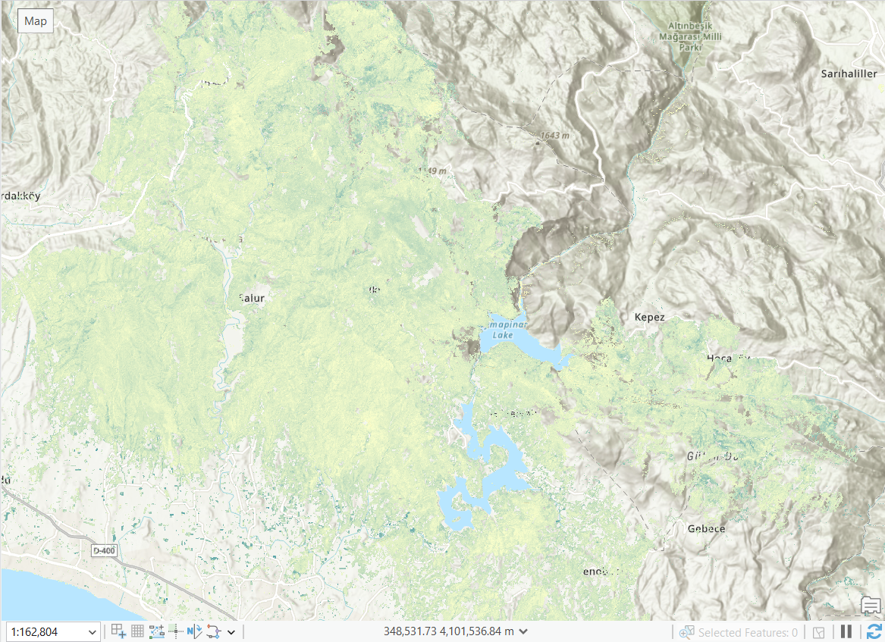
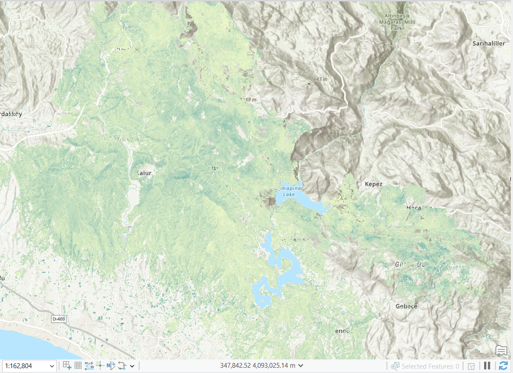
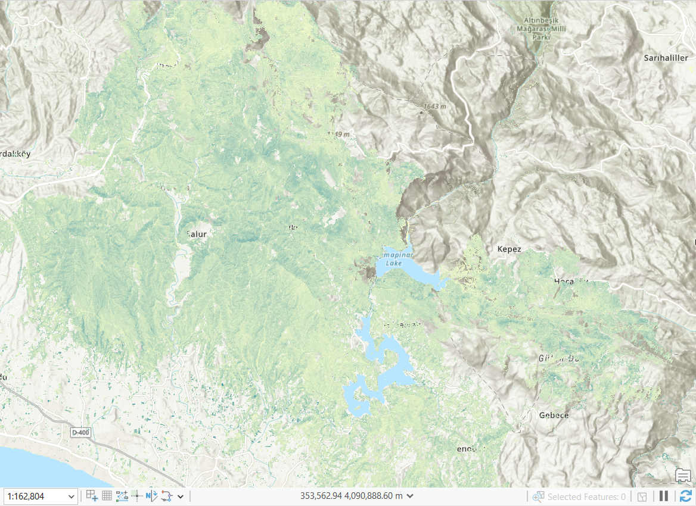

# Ateşin İzleri: 2021 Manavgat Orman Yangını Analizi

28 Temmuz 2021'de başlayıp on gün süren Manavgat orman yangını, Türkiye Cumhuriyeti tarihinin en büyük orman yangını felaketi olarak kayıtlara geçti. Bu proje, olayı Sentinel-2 uydu görüntüleri ve açık coğrafi veri kaynaklarıyla uçtan uca analiz ediyor: yanma şiddeti, meteorolojik koşullar, insan ve karbon etkisi, bitki örtüsünün 2022-2024 arası iyileşmesi ve gelecek yangın riski.

Projenin asıl vurgusu şurada: bir risk modeli veya etki tahmini üretmeden önce, her varsayım gerçek 2021 yanma verisiyle test edildi. Üç hipotezden ikisi doğrulandı, biri doğrulanmadı ve modelden çıkarıldı — bu süreç Bölüm 4'te ayrıntılı olarak anlatılıyor.

## 3B Uçuş Videosu

Kopernikus sayısal yükseklik modeli üzerine giydirilmiş dNBR şiddet haritası, Toros eteklerinden kıyıya inen bir kamera rotasıyla (ArcGIS Pro Local Scene + Animation ile üretildi).

<video src="https://github.com/dogadurak/FireImpact-GIS/raw/main/manavgat_3b_ucus_web.mp4" controls width="100%"></video>

*(Video bu sayfada oynatılamıyorsa: [doğrudan indir/izle](https://github.com/dogadurak/FireImpact-GIS/raw/main/manavgat_3b_ucus_web.mp4))*

## Öne Çıkan Sayılar

| Yanan alan | Tahmini karbon emisyonu | 5 km etki alanındaki nüfus | Model doğrulama tutarlılığı |
|---|---|---|---|
| 60.128 ha | ~2,97 milyon ton CO2 | 134.676 kişi | %96,4 |

## İçindekiler

1. [Felaketin Boyutu](#1-felaketin-boyutu)
2. [Yanma Şiddeti (dNBR)](#2-yanma-şiddeti-dnbr)
3. [Meteorolojik Bağlam](#3-meteorolojik-bağlam)
4. [Model Doğrulaması](#4-model-doğrulaması)
5. [İnsan Etkisi](#5-i̇nsan-etkisi)
6. [Karbon Ayak İzi](#6-karbon-ayak-i̇zi)
7. [Doğanın İyileşmesi (2022–2024)](#7-doğanın-i̇yileşmesi-20222024)
8. [Gelecek Risk Modeli](#8-gelecek-risk-modeli)
9. [Veri Kaynakları ve Yöntem](#9-veri-kaynakları-ve-yöntem)

---

## 1. Felaketin Boyutu

Yanan alan rakamı (60.128 ha) doğrudan bir sınıflandırma çıktısından alınmadı. Ham dNBR sınıflandırması ilk aşamada 103.447 hektar gösteriyordu; bu, bağımsız kaynaklarda bildirilen 56.663-75.000 ha aralığının belirgin şekilde üzerindeydi. İnceleme, sınıflandırılan pikselin büyük kısmının Antalya şehir merkezi ve tarım arazilerinde dağılmış, birbirinden kopuk küçük parçalardan (bulut gölgesi ve hasat kaynaklı yanlış-pozitifler) oluştuğunu ortaya çıkardı. Yalnızca 100 hektarın üzerindeki bitişik parçalar gerçek yangın kabul edildiğinde toplam alan 60.128 hektara indi — bağımsız bir uydu çalışmasının (56.663 ha) ve Antalya Orman Bölge Müdürlüğü'nün açıkladığı rakamın (75.000 ha) arasında.

## 2. Yanma Şiddeti (dNBR)

Yanma şiddeti, Normalize Edilmiş Yanma Oranı Farkı (dNBR) ile ölçüldü: yakın kızılötesi (Sentinel-2 B08) ve kısa dalga kızılötesi (B12) bantları arasındaki oranın yangın öncesi ve sonrası farkı alınarak hesaplandı, ardından USGS eşiklerine göre beş sınıfa ayrıldı.

Renk skalası düşükten yükseğe: sarı, turuncu, kırmızı, bordo.

| Şiddet sınıfı | Alan |
|---|---|
| Düşük | 17.777 ha |
| Orta-düşük | 15.834 ha |
| Orta-yüksek | 12.391 ha |
| Yüksek | 14.128 ha |

## 3. Meteorolojik Bağlam

Yangının bu kadar hızlı yayılmasının arkasındaki koşulları anlamak için, yangın günlerine ait sıcaklık, rüzgar ve yağış verileri 2015-2020 ortalamasıyla karşılaştırıldı. Sonuç beklenenden farklı çıktı: asıl anomali sıcaklıktı (ortalamanın +1,8°C üzerinde), yağış farkı ise (-0,8 mm) istatistiksel olarak anlamsız düzeydeydi. Bu yüzden burada "kuraklık" değil, "anormal sıcak bir Akdeniz yazı" ifadesi kullanılıyor — veri ikincisini destekliyor. Yangın günlerinde baskın rüzgar kuzeyden esti ve yayılmayı kıyıya doğru hızlandırdı.

<table>
<tr>
<td></td>
<td></td>
</tr>
</table>

## 4. Model Doğrulaması

Gelecek yangın riski modelini kurmadan önce, yaygın olarak kabul edilen üç varsayım, 2021'in gerçek yanma verisine karşı zonal istatistiklerle test edildi.

| Hipotez | Test sonucu | Karar |
|---|---|---|
| Güney bakılı yamaçlar daha şiddetli yanar | Ortalama gerçek dNBR: güney 0,436, doğu/batı 0,409, kuzey 0,364 — düzenli ve beklenen yönde | Doğrulandı |
| Dik eğim daha şiddetli yanmayla ilişkilidir | Orta eğim (0,433), dik alanlardan (0,395) ve düz alanlardan (0,379) daha şiddetli yanmış — tutarlı bir ilişki yok | Doğrulanmadı, modelden çıkarıldı |
| Yoğun bitki örtüsü (yüksek NDVI) daha fazla yakıt taşır | Yangın-öncesi NDVI, şiddetle birlikte düzenli arttı: yanmamış alanlarda 0,42, en yüksek şiddette 0,70 | Doğrulandı |

İkinci hipotezin doğrulanmaması iki kez daha sınandı — önce sınıflandırma gürültüsü ayıklanmış temiz veriyle, sonra da eğimin coğrafi koordinat sistemi yerine önce projeksiyonlanmış bir sayısal yükseklik modelinden doğru sırayla yeniden hesaplanmasıyla. Sonuç her ikisinde de değişmedi. Nihai risk modeli bu yüzden yalnızca bakı ve bitki örtüsü yoğunluğunu kullanıyor.

<table>
<tr>
<td></td>
<td></td>
</tr>
</table>

## 5. İnsan Etkisi

İlk taslak analizde yangının etki alanı, tek bir merkez nokta etrafında çizilmiş 8 kilometrelik bir daireydi ve yerleşim yerleri örnek/tahmini koordinatlarla temsil ediliyordu. Bu, nihai analizde gerçek verilerle değiştirildi: yangın sınırı doğrudan dNBR sınıflandırmasından çıkarıldı, yerleşim noktaları OpenStreetMap'ten alındı (175 nokta) ve nüfus WorldPop 2020 verisiyle hesaplandı.

| Bölge | Nüfus | Yerleşim sayısı |
|---|---|---|
| Yangın alanı içi | 1.623 | — |
| 0-1 km | 9.116 | 46 |
| 1-3 km | 43.774 | 29 |
| 3-5 km | 80.162 | 18 |
| Toplam (5 km içinde) | 134.676 | 93 |

## 6. Karbon Ayak İzi

Karbon emisyonu, IPCC'nin 2006 Ulusal Sera Gazı Envanterleri Kılavuzu'ndaki standart yöntemle (yanan alan × biyokütle × yanma faktörü × emisyon faktörü) hesaplandı. İlk hesapta biyokütle için Akdeniz iğne yapraklı ormanları için genel bir literatür aralığı (50-130 ton/ha) kullanılmıştı; bu daha sonra ESA CCI Biomass'ın 2020 uydu verisiyle, Manavgat'ın o ormanına özgü ölçülmüş biyokütle değeriyle değiştirildi.

Sonuç: yaklaşık 2,97 milyon ton CO2 (2,38-3,56 milyon ton aralığı, ESA CCI Biomass ürününün kendi belgelenmiş ±%20 doğruluk payına dayanarak) — yaklaşık 646.000 aracın bir yıllık emisyonuna eşdeğer. Yanan alan ve biyokütle uydudan ölçülen gerçek veri olsa da, yanmanın ne kadar tam gerçekleştiği (yanma faktörü) hâlâ literatüre dayalı bir varsayım; bu yüzden sonuç ölçülmüş değil, tahmini olarak sunuluyor.

## 7. Doğanın İyileşmesi (2022–2024)

Yanan alandaki bitki örtüsü sağlığı, NBR indeksiyle üç yıl boyunca izlendi. Üç haritanın da aynı renk skalasında (-1 ile 0,7 arası) sembolize edilmesi önemliydi: her yıl kendi otomatik aralığıyla gösterilseydi, sembol ayarlarındaki fark gerçek iyileşmeyle karıştırılabilirdi.

Yıl yıl:

<table>
<tr>
<td width="33%"> 2022 — yangının birinci yılı, kahverengi alanlar hâlâ baskın.</td>
<td width="33%"> 2023 — yeşil tonların genişlemesi, ilk yeniden yeşermenin izleri.</td>
<td width="33%"> 2024 — üç yılın en yeşil hali, ama en şiddetli yanan çekirdek bölgelerde toparlanma hâlâ görece yavaş.</td>
</tr>
</table>

## 8. Gelecek Risk Modeli

Bölüm 4'teki doğrulamaya dayanarak, gelecek yangın riski modeli iki bileşenden oluşuyor: bakı (%50 ağırlık) ve bitki örtüsü yoğunluğu/yakıt yükü (%50 ağırlık). Eğim, gerçek veriyle test edildiğinde tutarlı bir ilişki göstermediği için modele dahil edilmedi. Model, yalnızca 2021'de yanan alanla sınırlı değil — henüz yanmamış çevredeki ormanı da kapsıyor.

Renk skalası: açık sarı (düşük risk) → koyu kırmızı (yüksek risk).

## 9. Veri Kaynakları ve Yöntem

**Veri:**
- Sentinel-2 L2A, Microsoft Planetary Computer üzerinden
- Copernicus DEM (GLO-30)
- ESA CCI Biomass v6.0 (2020), CEDA arşivi
- WorldPop 2020 (BM-düzeltmeli, kısıtlanmış)
- OpenStreetMap (yerleşim noktaları)
- Open-Meteo tarihsel arşivi (meteoroloji)

**Yöntem:** dNBR ve USGS şiddet sınıflandırması; zonal istatistiklerle hipotez doğrulama; IPCC 2006 AFOLU yöntemiyle karbon emisyonu tahmini; ArcGIS Pro (arcpy, Spatial Analyst) ve Python (pandas, numpy, matplotlib, rasterio) ile uçtan uca otomasyon; ArcGIS Pro 3D Local Scene ve Animation ile görselleştirme.

---

Bu projedeki tüm rakamlar, mümkün olduğunca bağımsız kaynaklarla (akademik bir uydu çalışması, Antalya Orman Bölge Müdürlüğü'nün açıklamaları, WorldPop, ESA) karşılaştırılarak doğrulanmıştır. Karbon ve nüfus rakamları, ölçüm değil model/tahmin verisi oldukları için metin içinde bu şekilde belirtilmiştir.
