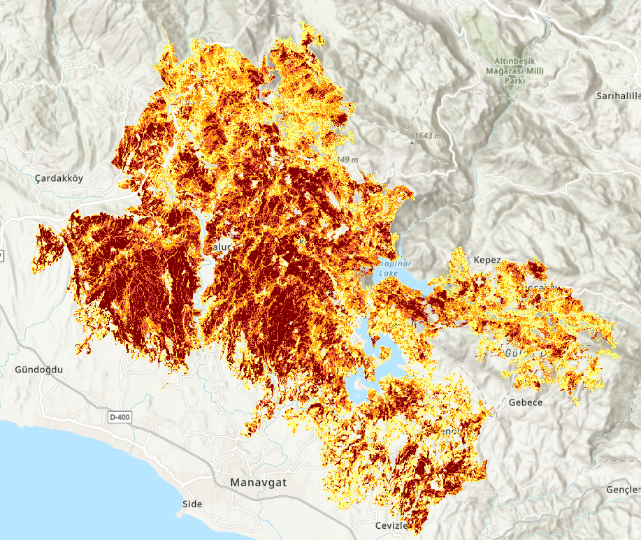
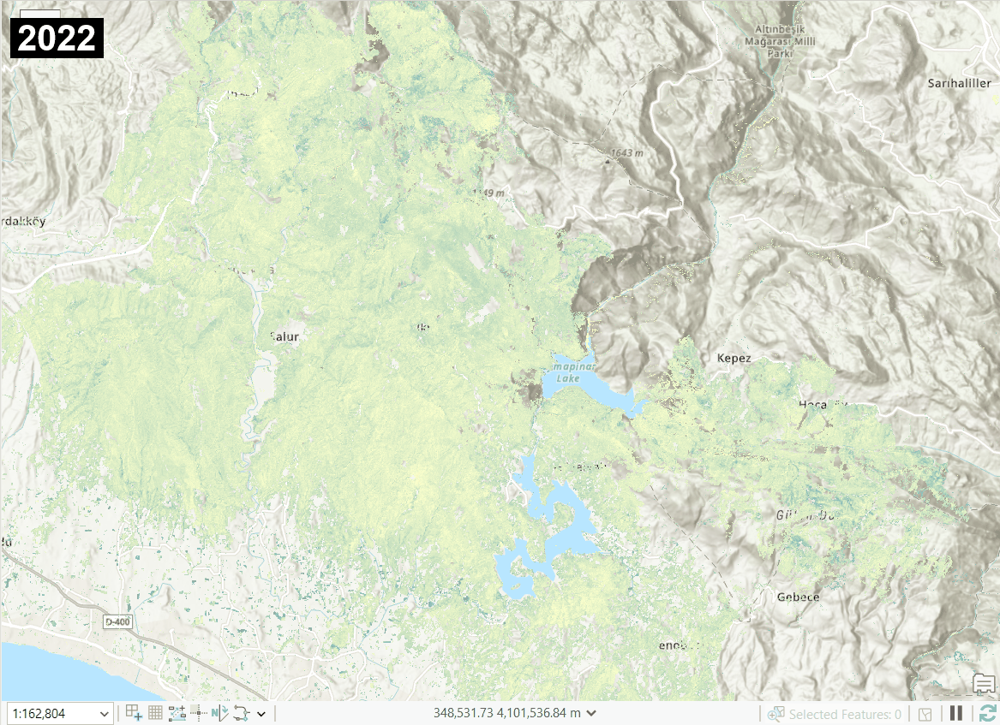
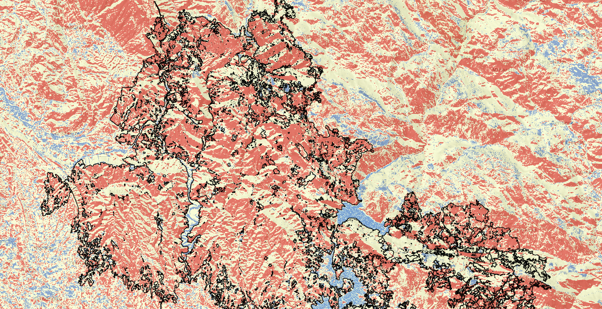

# FireImpact GIS: A Spatial Analysis of the Manavgat Forest Fire

**[🌍 Explore the Interactive Analysis Portfolio Here](https://dogadurak.github.io/FireImpact-GIS/)**

FireImpact GIS is a comprehensive, satellite-based spatial analysis of Turkey's largest recorded forest fire (Manavgat, 2021). Built entirely in **ArcGIS Pro**, this project analyzes burn severity, human and carbon impact, vegetation recovery over a 4-year time series, and includes a predictive future-risk model trained on variables that correlated strongly with the real 2021 burn data.

## Project Overview & Key Findings

The Manavgat fire of 2021 devastated over 60,000 hectares of forest. This project goes beyond simple mapping to quantify the ecological and human impact:

* **Burn Severity (dNBR):** Using pre- and post-fire Sentinel-2 imagery, we calculated the differenced Normalized Burn Ratio (dNBR). Findings indicate that the majority of the burned area suffered **High to Moderate-High severity** damage, completely destroying the mature pine forest canopy.
* **Vegetation Recovery (2021-2024):** A multi-temporal NDVI analysis reveals the natural regeneration process. While low-lying maquis vegetation and grasses rebounded relatively quickly (by 2023), the dense forest structure remains largely absent.
* **Future Risk Modeling:** By correlating the 2021 burn scars with environmental variables (Wind Speed, NDWI/Drought Index, Slope, Aspect, and Elevation), we built a predictive spatial model. The model successfully identified that **high wind corridors combined with steep, south-facing slopes** were the primary drivers of extreme fire behavior, allowing us to map high-risk zones for future incidents.
* **Carbon & Human Impact:** The massive loss of biomass resulted in significant carbon emissions, and spatial buffers revealed the proximity of the severe burn zones to local settlements.

## 3D Spatial Visualization
A 3D fly-through generated in ArcGIS Pro, providing a topographic perspective of the burn scars and the rugged terrain of the Taurus Mountains.

<video src="manavgat_3b_ucus_web.mp4" width="100%" controls autoplay loop muted></video>

## Burn Severity (dNBR) Map

## Vegetation Recovery (2021-2024)

## Future Risk Modeling

---
*Developed by Doğa Durak, Geomatics Engineer & GIS Analyst.*
